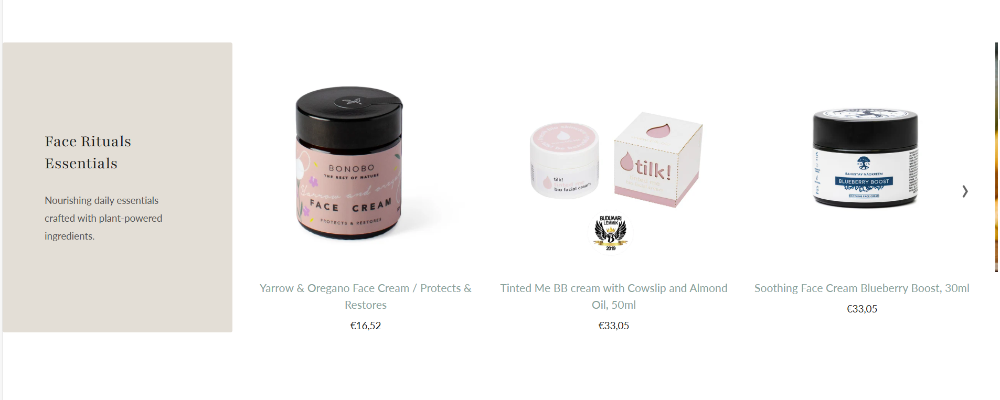

# Shopify Theme Customizations

This repository contains real-world Shopify theme customizations built with **Liquid**, **HTML**, **CSS**, and **JavaScript**.

The goal of this project is to demonstrate practical Shopify development skills used in production stores, including performance optimization and SEO-friendly implementations.

---

## What you’ll find here

- Custom Shopify sections
- Liquid snippets and logic
- Theme performance improvements
- SEO-focused adjustments
- Clean, maintainable code structure

---
## Sections

### Discover by category
A responsive 6-tile category grid inspired by premium DTC layouts:
- Desktop: 6 tiles in one row
- Tablet/mobile: 3x2 grid
- Optional links per tile
- Image picker + title per tile (max 6)
File: `sections/discover-by-category.liquid`

### Featured spotlight

A responsive featured products carousel with editorial intro content:

- Desktop: intro displayed as the first slide, followed by products
- Mobile: intro placed above the carousel for improved UX
- Collection-based product source with configurable product limit
- Accessible controls (keyboard navigation, focus-visible, aria-current)
- Mobile pagination with scroll-snap behavior
File: `sections/featured-spotlight.liquid`

## Technologies

- Shopify Liquid
- HTML5 / CSS3
- JavaScript
- Shopify Online Store 2.0

---

## Purpose

This repository is part of my **Shopify Developer portfolio** and is continuously expanded with new examples and improvements.

---

## Author

Shopify Developer  
Focused on clean code, performance and scalable theme solutions.
